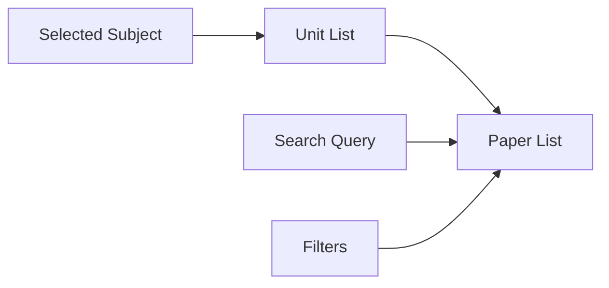
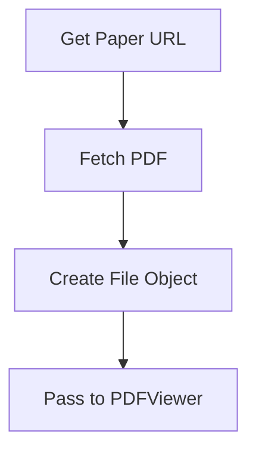
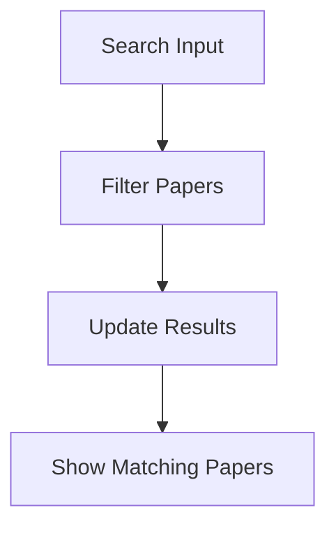

# Annotator Page Implementation Plan

## Overview

The goal is to create a paper selection system for the annotator page while preserving the existing PDF viewer functionality. The implementation will follow the existing UI patterns from the papers/[subject] and search pages.

## Requirements

- Keep the existing PDF viewer and annotation functionality intact
- Create a paper selection UI similar to papers/[subject] page
- Implement search functionality like the search page
- Only show PDFs with direct links (ending in .pdf)
- Use existing theme CSS classes for consistent styling

## Important Warnings

⚠️ DO NOT modify:

- src/components/annotator/PDFViewer.tsx and its functionality
- Existing pages (/papers/[subject], /search)
- Any existing annotation-related code

⚠️ Component Reuse Warning:

- Even if you need functionality similar to existing components (like FilterBox or SearchBox), DO NOT modify them
- Instead, create new components specifically for the annotator functionality
- This may result in some code duplication, but it ensures we don't break existing features
- Example: Create 'AnnotateFilterBox' instead of modifying 'FilterBox'

## Implementation Phases

### Phase 1: Route Structure and Basic Pages

1. Create new routes:

```
/annotate/select - Paper selection page
/annotate/view/[paperId] - PDF viewer page
```

2. Implement base layouts for both pages using existing theme classes

3. Create component hierarchy:

```mermaid
graph TD
    A[/annotate/select] --> B[AnnotateSubjectList]
    A --> C[AnnotateSearchBox]
    B --> D[AnnotateUnitList]
    D --> E[AnnotatePaperList]
    A --> F[AnnotateFilterBox]
```

Note: All components are new and specific to the annotator feature

### Phase 2: Paper Selection UI

1. Create new components:

- AnnotateSubjectList: Display available subjects with units
- AnnotateUnitList: Show papers for selected unit
- AnnotatePaperList: Display filtered paper list
- AnnotateFilterBox: Year/session filters

2. Implement data filtering:

- Filter papers that don't have direct PDF links
- Add year/session filtering
- Implement search functionality

3. State management:



### Phase 3: PDF Viewer Integration

1. Create the viewer page layout:

- Use existing PDFViewer component
- Add navigation controls
- Implement paper loading

2. Handle file loading:



3. Add error handling for invalid PDFs

### Phase 4: Search Implementation

1. Integrate search functionality:

- Create new search components specific to annotator
- Implement paper filtering
- Add search suggestions

2. Search workflow:



### Phase 5: UI Polish and Testing

1. Add loading states
2. Implement error boundaries
3. Add responsive design tweaks
4. Test all user flows:
   - Subject selection
   - Unit filtering
   - Paper search
   - PDF viewing
   - Annotation functionality

## Folder Structure

```
src/
  app/
    annotate/
      select/
        page.tsx
      view/
        [paperId]/
          page.tsx
  components/
    annotate-select/
      AnnotateSubjectList.tsx
      AnnotateUnitList.tsx
      AnnotatePaperList.tsx
      AnnotateFilterBox.tsx
      AnnotateSearchBox.tsx
```

## Development Guidelines

1. Maintain existing UI patterns:

   - Use consistent theme classes
   - Follow established component structure
   - Keep same filter behavior
   - Create new components instead of modifying existing ones

2. Performance considerations:

   - Lazy load components
   - Implement proper suspense boundaries
   - Cache paper data when appropriate

3. Error handling:
   - Handle invalid paper IDs
   - Show proper error states
   - Validate PDF URLs
   - Handle non-PDF file URLs gracefully

## Implementation Order

1. Start with Phase 1 to set up routes and base structure
2. Move to Phase 2 for paper selection UI
3. Implement Phase 3 for PDF viewer integration
4. Add search functionality in Phase 4
5. Polish and test in Phase 5

This phased approach allows for testing each component independently before integration. Remember to create new components rather than modifying existing ones, even if it means duplicating some functionality.
