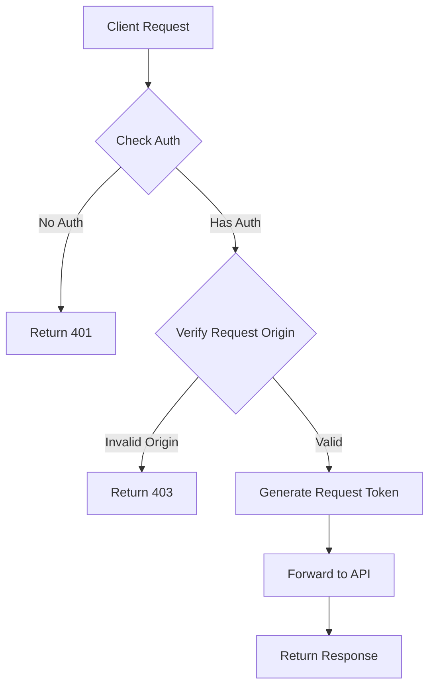

# API Security Implementation Plan

## Overview

This document outlines the security implementation plan for protecting the paper and subject API routes from unauthorized access while maintaining functionality for legitimate frontend requests.

## Current System Analysis

### API Routes

- `/api/papers` and `/api/subjects` act as proxy routes to PAPERVOID_API_URL
- Currently excluded from middleware authentication checks
- Directly accessible via public URLs
- No protection against network inspector monitoring

### Authentication System

- JWT-based auth with access and refresh tokens
- AuthContext handles frontend auth state
- API calls currently don't include auth headers

## Security Implementation Plan

### 1. API Protection Layer



#### Middleware Updates

- Remove `/api/papers` and `/api/subjects` from middleware exclusion list
- Add JWT verification for these routes
- Implement request origin validation using referer headers

#### API Route Changes

```typescript
// Example implementation for papers route
export async function GET(request: NextRequest) {
  // Verify auth token
  const token = request.cookies.get("auth-token");
  if (!token) {
    return new Response("Unauthorized", { status: 401 });
  }

  // Verify request origin
  const referer = request.headers.get("referer");
  if (!referer || !referer.startsWith(process.env.NEXT_PUBLIC_APP_URL)) {
    return new Response("Forbidden", { status: 403 });
  }

  // Continue with existing logic...
}
```

### 2. Request Security

#### Request Tokens

- Generate unique request tokens for each API call
- Short-lived tokens (30 seconds) to prevent replay attacks
- Include in request headers

#### Request Signing

```typescript
interface SignedRequest {
  timestamp: number;
  token: string;
  signature: string;
}

// Generate request signature using HMAC
const signRequest = (token: string, timestamp: number) => {
  const message = `${token}:${timestamp}`;
  return crypto
    .createHmac("sha256", process.env.API_SECRET)
    .update(message)
    .digest("hex");
};
```

### 3. Response Security

#### Response Protection

- Add integrity checks using response signing
- Set appropriate cache control headers

```typescript
// Example response headers
{
  'Cache-Control': 'no-store, must-revalidate',
  'Pragma': 'no-cache',
  'X-Content-Type-Options': 'nosniff'
}
```

### 4. Network Inspector Protection

#### Request Obfuscation

- Implement dynamic request signing
- Rotate request tokens frequently
- Add noise parameters to requests

#### Frontend Implementation

```typescript
// Example of protected API call
const fetchData = async (path: string) => {
  const timestamp = Date.now();
  const requestToken = await generateRequestToken();

  const response = await fetch(`/api/papers?path=${path}`, {
    headers: {
      "X-Request-Token": requestToken,
      "X-Request-Timestamp": timestamp.toString(),
      "X-Request-Signature": signRequest(requestToken, timestamp),
    },
    credentials: "include", // Include auth cookies
  });

  return response.json();
};
```

## Implementation Steps

1. Update middleware configuration
2. Implement request signing and verification
3. Add auth checks to API routes
4. Update frontend API client code
5. Add response security headers
6. Test security measures thoroughly

## Security Considerations

- Token rotation and expiry
- Request signature validation
- Origin verification
- Response integrity checks
- Prevention of request tampering
- Protection against replay attacks

## Notes

- Implementation should maintain current frontend functionality
- Security measures should be transparent to end users
- Performance impact should be minimal
- Error handling should be graceful with appropriate status codes
