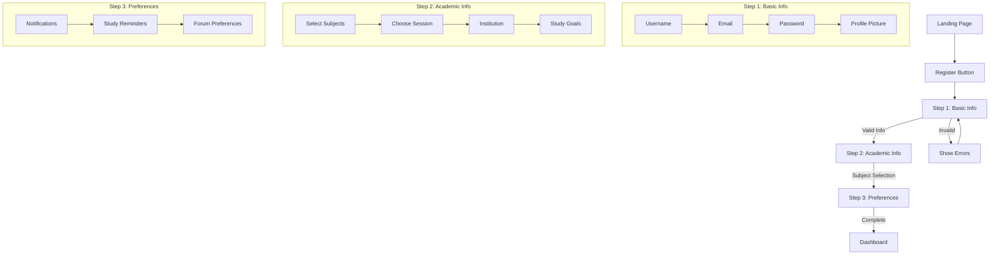
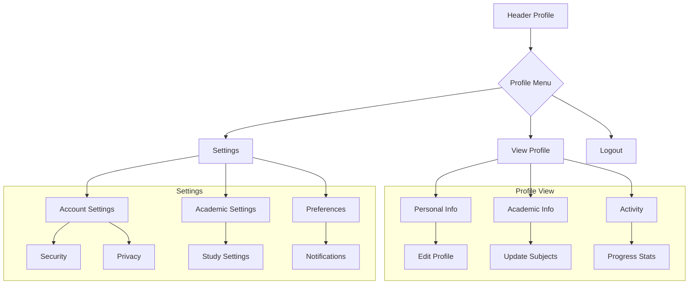
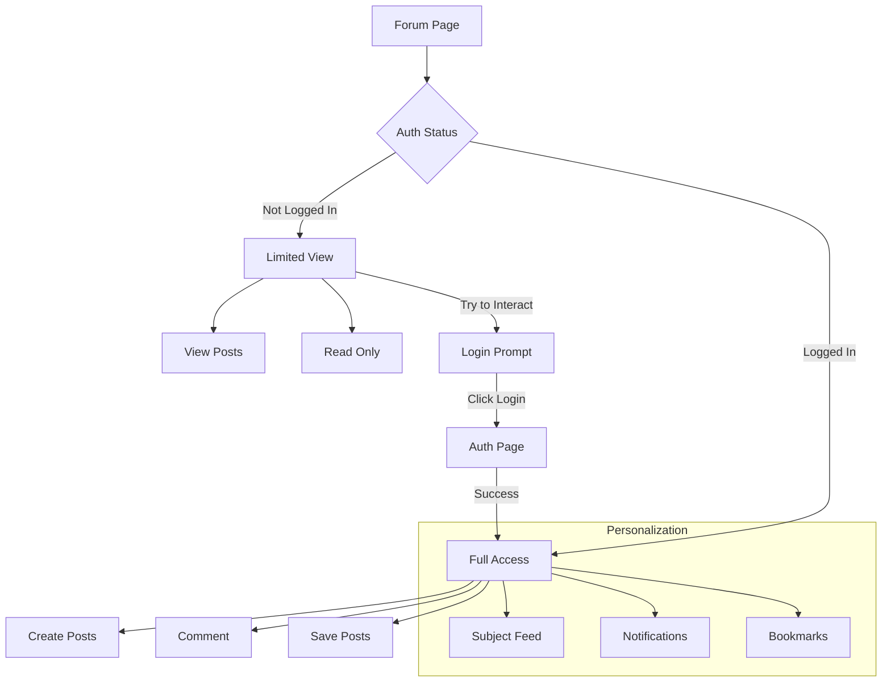
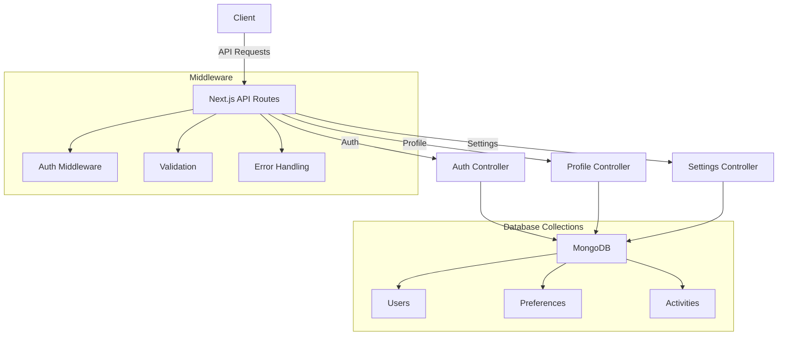

# Authentication Flow Diagrams

## Registration Flow

## Profile Management Flow

## Forum Integration

This visualization shows the main flows and interactions in the new authentication and profile system. The modular design allows for easy extension with new features while maintaining a clear and intuitive user experience.

## Technical Architecture

The technical architecture ensures clean separation of concerns while maintaining high performance and scalability. The modular structure allows for easy addition of new features and modifications to existing ones.
