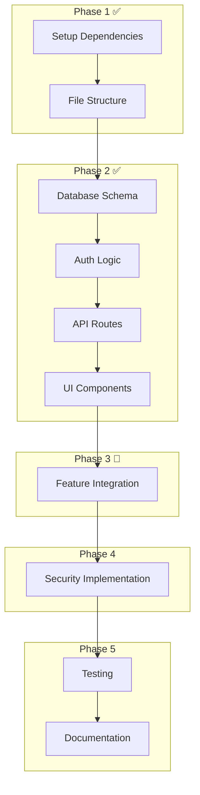

# Authentication System Implementation Plan

## Phase 1: Core Infrastructure ✅

1. **Dependencies Installation** ✅

```bash
npm install bcryptjs jose cookie
npm install -D @types/bcryptjs @types/cookie
```

2. **File Structure Setup** ✅

```
src/
├── models/
│   └── User.ts             # MongoDB user model with schema ✅
├── lib/
│   ├── auth/              # Break down auth into smaller files ✅
│   │   ├── index.ts       # Main exports ✅
│   │   ├── jwt.ts         # JWT utilities ✅
│   │   ├── cookies.ts     # Cookie management ✅
│   │   └── validation.ts  # Input validation ✅
│   └── authTypes.ts       # TypeScript definitions ✅
├── app/api/auth/          # Auth API routes ✅
│   ├── login/
│   ├── register/
│   ├── logout/
│   └── refresh/
└── components/auth/       # Auth UI components ✅
    ├── LoginModal.tsx
    ├── LoginForm.tsx
    ├── RegisterForm.tsx
    └── ProtectedContent.tsx
```

## Phase 2: Core Implementation ✅

1. **Database Schema & Models** ✅

   - Implement User model with MongoDB schema
   - Set up indexes for username, email, refresh tokens
   - Add user role management

2. **Authentication Logic** ✅

   - JWT token generation and validation
   - Password hashing and verification
   - Session management with refresh tokens
   - Access control middleware

3. **API Routes** ✅

   - Login endpoint with validation
   - Registration with duplicate checking
   - Logout and token invalidation
   - Token refresh endpoint

4. **Client Components** ✅
   - Auth context provider
   - Login/Register modal with forms
   - Protected route wrapper
   - Auth state management

## Phase 3: Integration (In Progress)

1. **Forum Integration**

   - Update forum posts to require auth
   - Add user info to posts/replies
   - Implement moderation features
   - Add role-based access control

2. **Other Features**
   - Protect note saving
   - Add auth to annotations
   - Implement study progress tracking
   - Set up personal collections

## Phase 4: Security & Polish (Pending)

1. **Security Features**

   - Rate limiting on auth endpoints
   - CSRF protection
   - Secure headers
   - Input validation/sanitization

2. **User Experience**
   - Loading states
   - Error handling
   - Form validation
   - Success/error messages

## Phase 5: Testing & Documentation (Pending)

1. **Testing**

   - Unit tests for auth utilities
   - Integration tests for API routes
   - E2E tests for auth flows
   - Security testing

2. **Documentation**
   - API documentation
   - Security practices
   - Deployment guide
   - Maintenance procedures

## Implementation Flow



## Environmental Requirements

1. **Environment Variables** ✅

```
MONGODB_URI=mongodb://...
JWT_SECRET=<strong-random-secret>
NEXT_PUBLIC_URL=http://localhost:3000
```

2. **Security Configurations** ✅
   - CORS settings
   - Rate limiting rules
   - Cookie security options
   - CSP headers

## Implementation Notes

- Old admin token functionality has been migrated to new role-based system ✅
- Forum features updated to use new auth system
- Authentication state managed through HTTP-only cookies ✅
- Rate limiting implementation planned for Phase 4
