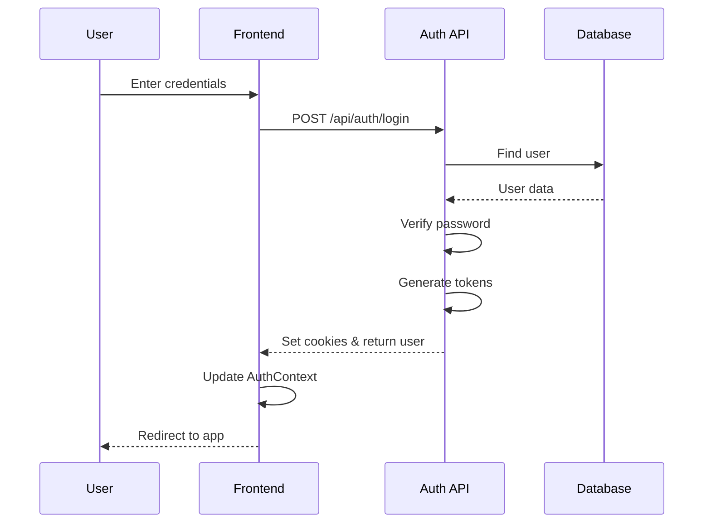
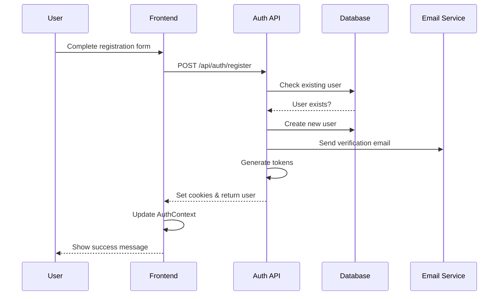
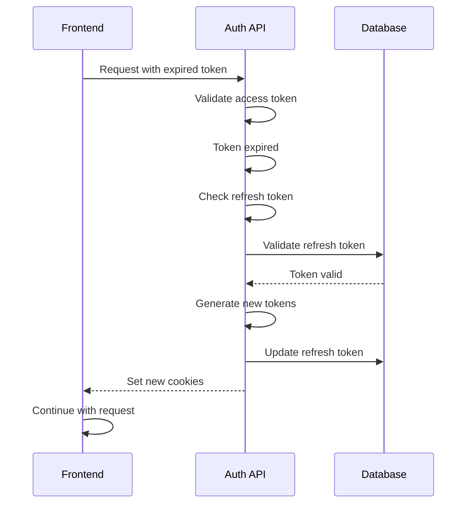
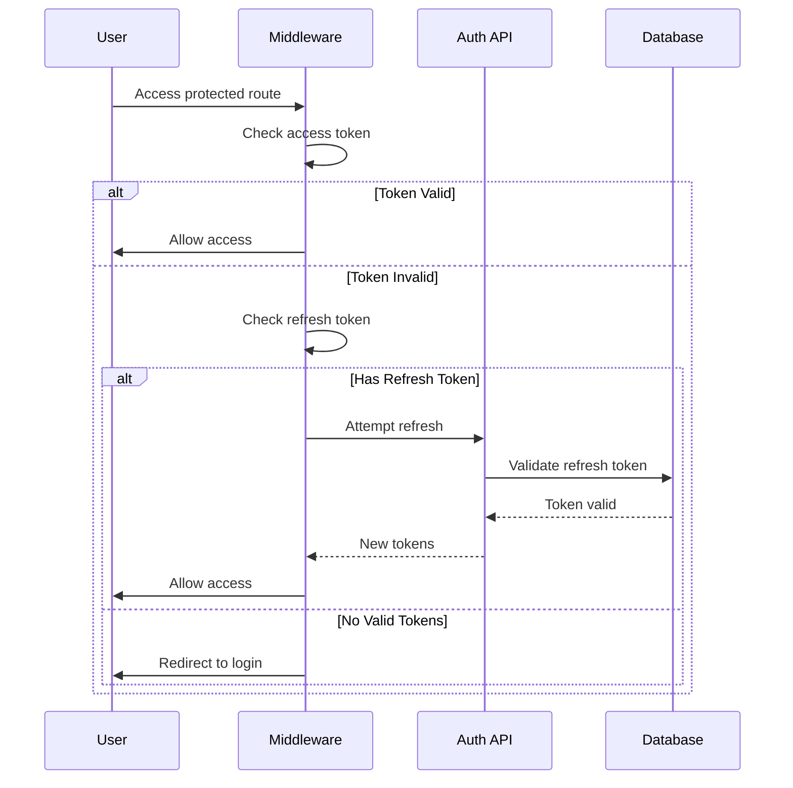
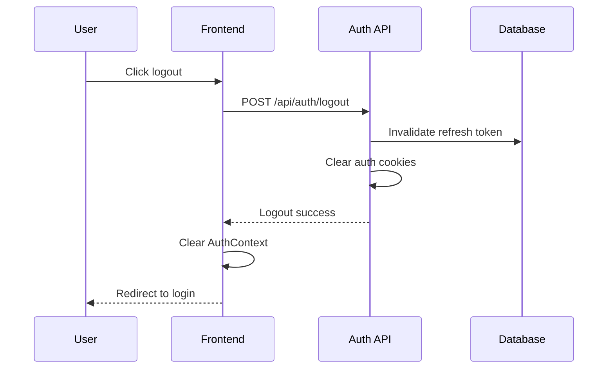
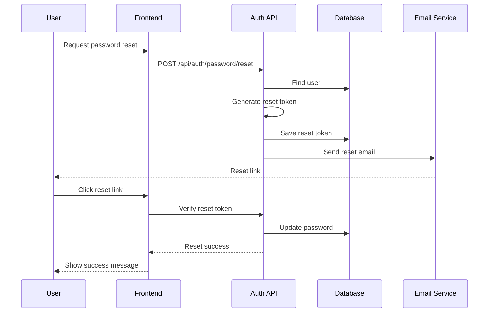
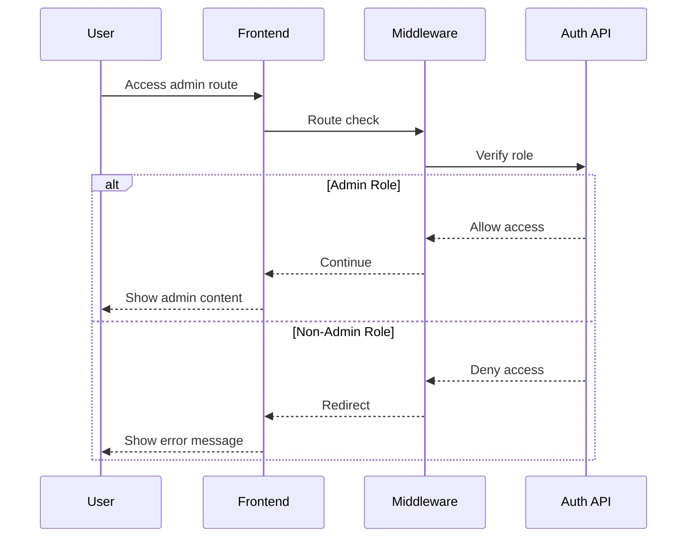

# Authentication Flow Diagrams

## Login Flow

## Registration Flow

## Token Refresh Flow

## Protected Route Access

## Logout Flow

## Password Reset Flow

## Role-Based Access Control

## Important Notes

1. **Error Handling**

   - All flows should include error handling
   - Proper user feedback
   - Secure error logging

2. **State Management**

   - AuthContext updates
   - Cookie management
   - Session tracking

3. **Security Considerations**

   - Token validation
   - Role verification
   - Session management

4. **User Experience**
   - Loading states
   - Error messages
   - Success feedback

Remember to update these diagrams when modifying authentication flows or adding new features.
