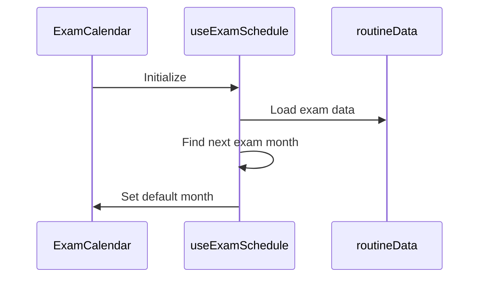
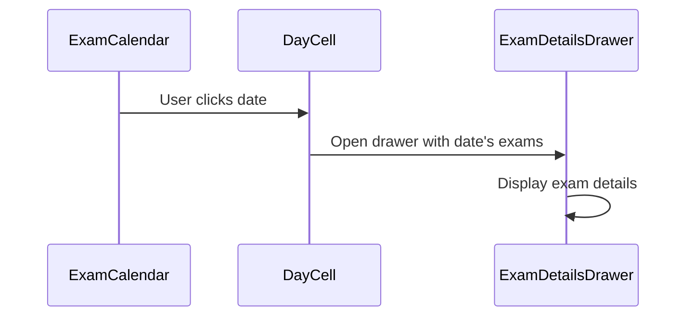
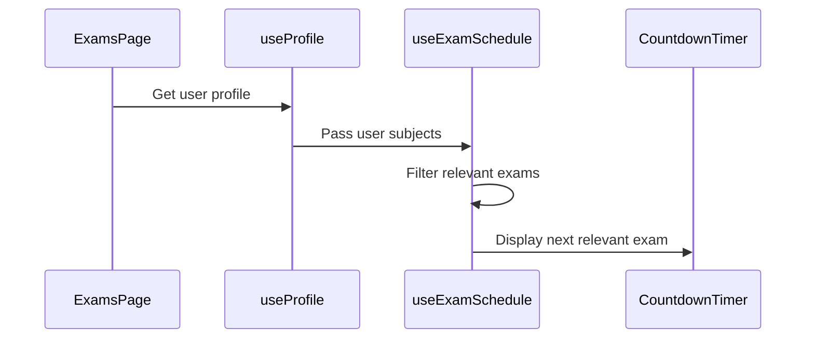

# Calendar Updates Implementation Plan

## Overview

Implementation plan for calendar improvements including default exam month, side drawer for exam details, and smart countdown display.

## 1. Calendar Default Month

### Changes Required:

- Modify ExamCalendar component to find next exam month on initialization
- Update currentDate state to default to that month
- Add logic to handle no upcoming exams case

## 2. Exam Details Drawer

### Component Structure:

- New ExamDetailsDrawer component
- Responsive layout for mobile/desktop
- Exam information display:
  - Subject name and code
  - Exam title
  - Date and time
  - Duration
  - Room/venue
  - Special instructions

## 3. Smart Countdown Logic

### Hook Updates:

- Update useExamSchedule:
  - Filter exams by user subjects when logged in
  - Find absolute next exam when not logged in
  - Consider exam relevance from profile

### Component Updates:

- Modify CountdownTimer:
  - Accept targetExam prop
  - Show detailed exam info
  - Handle auth states

## 4. Mobile Optimizations

- Responsive drawer implementation
- Touch gesture support
- Optimized exam details display

## Next Steps

1. Create ExamDetailsDrawer component
2. Update ExamCalendar date selection
3. Modify useExamSchedule hook
4. Update CountdownTimer component
5. Add mobile optimizations
