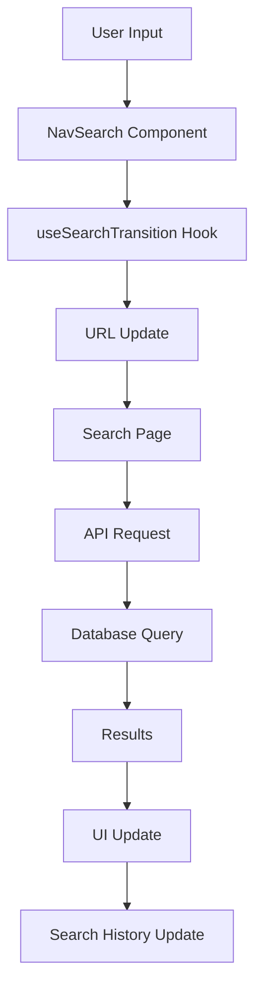
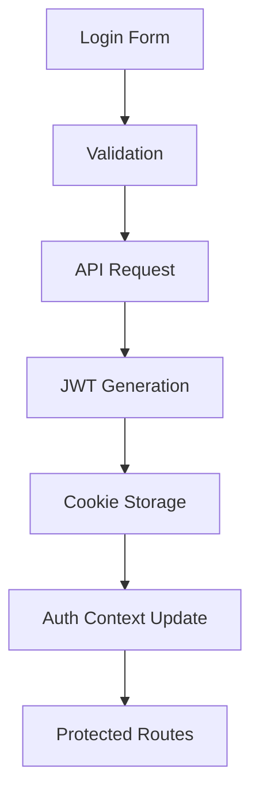
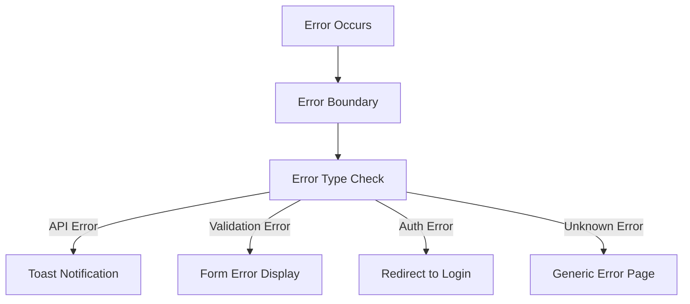

# Data Flow Documentation

## Overview

This document describes how data flows through different parts of the application, from user interactions to database updates.

## Core Data Flows

### Search Flow



1. User types in search box
2. Input debounced (300ms)
3. URL updated with search params
4. Search page receives query
5. API request made to backend
6. Results displayed with transitions

### Authentication Flow



### Data Fetching Pattern

```typescript
// Example of typical data fetching pattern
async function fetchData<T>(endpoint: string): Promise<T> {
  // 1. Check cache
  const cached = await cache.get(endpoint);
  if (cached) return cached;

  // 2. Make request
  const response = await fetch(`/api/${endpoint}`);

  // 3. Handle errors
  if (!response.ok) {
    throw new ApiError(response.statusText);
  }

  // 4. Parse and cache
  const data = await response.json();
  await cache.set(endpoint, data);

  return data;
}
```

## State Management

### Global State

- Auth state via Context
- Theme preferences
- Search context
- Navigation state

### Local State

- Form inputs
- UI interactions
- Loading states
- Error states

### Server State

- API responses
- Cache management
- Optimistic updates

## Data Update Patterns

### Optimistic Updates

```typescript
async function updateResource(id: string, update: Update) {
  // 1. Save current state
  const previousState = store.getState();

  // 2. Apply optimistic update
  store.update(id, update);

  try {
    // 3. Make API request
    await api.update(id, update);
  } catch (error) {
    // 4. Rollback on failure
    store.setState(previousState);
    throw error;
  }
}
```

### Form Submissions

```typescript
async function handleSubmit(data: FormData) {
  // 1. Validate
  const validationResult = validate(data);
  if (!validationResult.valid) {
    setErrors(validationResult.errors);
    return;
  }

  // 2. Show loading
  setSubmitting(true);

  try {
    // 3. Submit
    await submitData(data);

    // 4. Update UI
    onSuccess();
  } catch (error) {
    // 5. Handle errors
    setErrors(parseError(error));
  } finally {
    // 6. Reset state
    setSubmitting(false);
  }
}
```

## Cache Management

### Cache Strategy

```typescript
interface CacheOptions {
  ttl: number;
  staleWhileRevalidate: boolean;
}

class Cache {
  private store = new Map<string, CacheEntry>();

  async get(key: string, options: CacheOptions) {
    const entry = this.store.get(key);

    if (!entry) return null;

    if (this.isStale(entry)) {
      if (options.staleWhileRevalidate) {
        this.revalidate(key);
        return entry.data;
      }
      return null;
    }

    return entry.data;
  }
}
```

## Error Handling

### Error Flow



## Data Persistence

### Local Storage

```typescript
const storage = {
  set: (key: string, value: unknown) => {
    try {
      localStorage.setItem(key, JSON.stringify(value));
    } catch (error) {
      console.error("Storage error:", error);
    }
  },

  get: <T>(key: string): T | null => {
    try {
      const item = localStorage.getItem(key);
      return item ? JSON.parse(item) : null;
    } catch {
      return null;
    }
  },
};
```

### API Response Caching

```typescript
interface CacheStrategy {
  type: "memory" | "localStorage" | "none";
  ttl: number;
  maxSize: number;
}

const defaultStrategy: CacheStrategy = {
  type: "memory",
  ttl: 5 * 60 * 1000, // 5 minutes
  maxSize: 100,
};
```

## Real-time Updates

### WebSocket Integration

```typescript
interface WebSocketMessage {
  type: string;
  payload: unknown;
}

class WebSocketClient {
  private socket: WebSocket;
  private messageHandlers = new Map<string, (payload: unknown) => void>();

  constructor(url: string) {
    this.socket = new WebSocket(url);
    this.socket.onmessage = this.handleMessage;
  }

  private handleMessage = (event: MessageEvent) => {
    const { type, payload } = JSON.parse(event.data) as WebSocketMessage;
    const handler = this.messageHandlers.get(type);
    if (handler) {
      handler(payload);
    }
  };
}
```

## Performance Considerations

### Data Loading Strategies

1. Server-side rendering for initial load
2. Client-side fetching for dynamic updates
3. Incremental static regeneration for semi-static data
4. Streaming for large datasets

### Optimization Techniques

```typescript
// Example of data chunking
async function* loadLargeDataset() {
  let page = 1;
  const pageSize = 100;

  while (true) {
    const data = await fetchPage(page, pageSize);
    if (data.length === 0) break;

    yield data;
    page++;
  }
}
```

## Data Validation

### Client-side Validation

```typescript
interface ValidationRule<T> {
  validate: (value: T) => boolean;
  message: string;
}

const validator = {
  required: (value: unknown) => ({
    valid: value != null && value !== "",
    message: "This field is required",
  }),

  email: (value: string) => ({
    valid: /^[^\s@]+@[^\s@]+\.[^\s@]+$/.test(value),
    message: "Invalid email address",
  }),
};
```

### Server-side Validation

```typescript
interface ValidationPipeline {
  sanitize: (input: unknown) => unknown;
  validate: (input: unknown) => boolean;
  transform: (input: unknown) => unknown;
}

const createValidator = (pipeline: ValidationPipeline) => {
  return async (input: unknown) => {
    const sanitized = pipeline.sanitize(input);
    const isValid = await pipeline.validate(sanitized);

    if (!isValid) {
      throw new ValidationError("Invalid input");
    }

    return pipeline.transform(sanitized);
  };
};
```
