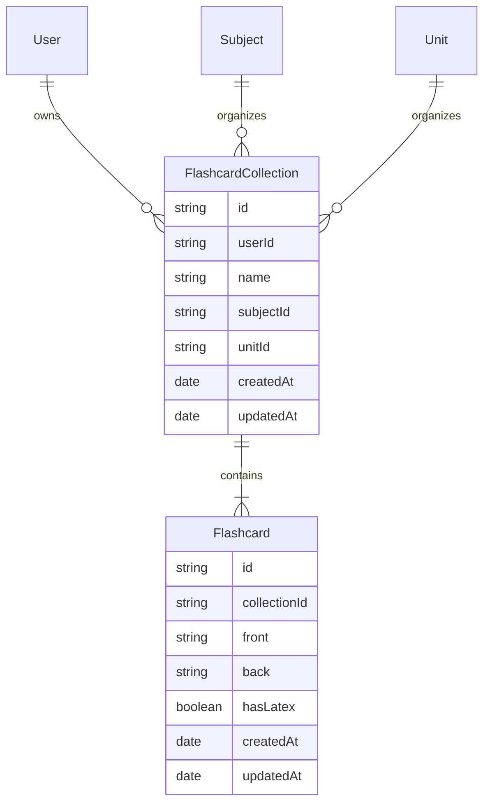
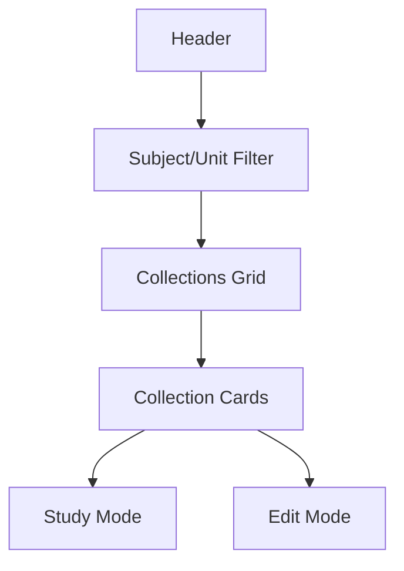

# Flashcards Feature Implementation Plan

## 1. Data Model



## 2. UI/UX Design

### Main Page Layout



### Study Mode Features

#### UI Layout

```
+------------------+
|    Progress      |
|  [███████----]   |
+------------------+
|                  |
|     Question     |
|                  |
|   LaTeX/Text     |
|                  |
+------------------+
|   [Flip Card]    |
+------------------+
|  Confidence Bar  |
| 1 - 2 - 3 - 4 - 5|
+------------------+
```

#### Features

- Smooth card flip animation with 3D effect
- Progress tracking:

  - Cards remaining in session
  - Success rate per collection
  - Study time analytics
  - Mastery level indicators

- Confidence rating system:

  - 1: "Need more practice"
  - 2: "Somewhat familiar"
  - 3: "Know it"
  - 4: "Know it well"
  - 5: "Mastered"

- Spaced repetition algorithm:
  - Based on confidence ratings
  - Custom review intervals
  - Smart card ordering
  - Review reminders
  - Progress persistence

### Editor Features

#### UI Layout

```
+----------------------+----------------------+
|     Editor Panel     |    Preview Panel    |
+----------------------+----------------------+
|   Rich Text Editor   |    Live Preview     |
|   [ LaTeX Tools ]    |    Card Display     |
|   Quick Templates    |    With Rendered    |
|                      |      LaTeX          |
+----------------------+----------------------+
```

#### Editor Features

- Rich text editor with split view:

  - Left: Edit mode with syntax highlighting
  - Right: Live preview with rendered LaTeX

- LaTeX Integration:

  - KaTeX for rendering
  - Syntax highlighting for LaTeX code
  - Error highlighting for invalid LaTeX
  - Auto-completion for common LaTeX commands

- Quick LaTeX Templates:

  ```latex
  - Basic Math:
    - Fractions: \frac{numerator}{denominator}
    - Powers: x^{power}
    - Square root: \sqrt{x}
    - nth root: \sqrt[n]{x}

  - Calculus:
    - Derivatives: \frac{d}{dx}
    - Integrals: \int_{lower}^{upper}
    - Limits: \lim_{x \to value}

  - Matrices:
    - 2x2: \begin{matrix} a & b \\ c & d \end{matrix}
    - With brackets: \begin{bmatrix} a & b \\ c & d \end{bmatrix}
  ```

- Preview mode with:

  - Card flip animation
  - Mobile preview
  - Different color themes

- Import/Export:
  - CSV import/export with LaTeX support
  - Anki deck import
  - Bulk operations with validation

## 3. Technical Implementation

### Frontend

1. New pages:

   - `/flashcards` - Main dashboard
   - `/flashcards/[collectionId]` - Study/Edit collection
   - `/flashcards/new` - Create collection

2. React Components:
   - FlashcardCollection
   - FlashcardEditor
   - StudyMode
   - LaTeXEditor
   - ProgressTracker

### Backend

1. API Routes:

   - `GET /api/flashcards` - List collections
   - `POST /api/flashcards` - Create collection
   - `GET /api/flashcards/[id]` - Get collection
   - `PUT /api/flashcards/[id]` - Update collection
   - `DELETE /api/flashcards/[id]` - Delete collection
   - `POST /api/flashcards/[id]/cards` - Add cards
   - `PUT /api/flashcards/[id]/cards/[cardId]` - Update card
   - `DELETE /api/flashcards/[id]/cards/[cardId]` - Delete card

2. Database Models:
   - FlashcardCollection
   - Flashcard
   - UserProgress

### LaTeX Integration

- Client-side LaTeX rendering using KaTeX
- Quick insert templates for common math expressions
- Live preview during editing
- Seamless mixing of text and equations

### Authentication & Security

- Use existing JWT auth system
- Check user ownership for all operations
- Rate limiting for API endpoints
- Input validation and sanitization

## 4. Development Phases

1. Phase 1 - Core Features

   - Basic CRUD for collections and cards
   - Simple card editor
   - Basic study mode

2. Phase 2 - Enhanced Editor

   - LaTeX integration
   - Rich text formatting
   - Quick templates

3. Phase 3 - Study Features

   - Progress tracking
   - Spaced repetition
   - Statistics and insights

4. Phase 4 - Polish
   - Animations and transitions
   - Mobile optimization
   - Performance improvements
