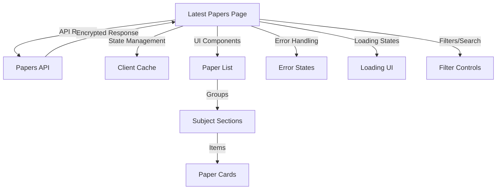

# Latest Papers Page Improvement Plan

## Current Issues

- Uses static JSON data instead of live API
- Lacks proper integration with the current paper system
- Missing modern features like loading states and error handling
- Limited paper metadata display
- No search or filter capabilities

## Architecture Overview



## Implementation Plan

### 1. API Integration

- Replace `getLatestPapers()` with API calls using `papersApi`
- Implement proper authentication handling
- Add request caching for performance
- Handle API errors gracefully
- Add loading states during API calls

### 2. Component Structure

```typescript
// Main page component with API integration
LatestPapersPage
  ├── LoadingSpinner
  ├── ErrorDisplay
  ├── FilterControls
  │     ├── SearchInput
  │     └── FilterDropdowns
  └── PapersList
        ├── SubjectSection (expandable)
        └── PaperCard
              ├── PaperInfo
              └── DownloadButtons
```

### 3. Feature Improvements

#### Data Handling

- Implement client-side caching
- Add pagination if paper count is large
- Add sorting options (by date, subject, etc.)
- Implement search and filtering

#### User Experience

- Add loading skeletons for better loading UX
- Implement error boundaries
- Add toast notifications for actions
- Improve accessibility (ARIA labels, keyboard navigation)
- Add tooltips for additional paper information

#### Visual Enhancements

- Keep current clean layout and expandable sections
- Add visual feedback for interactions
- Improve responsive design
- Add animations for state changes
- Implement dark mode support

### 4. Performance Optimizations

- Implement lazy loading for paper sections
- Add request debouncing for search/filter
- Optimize bundle size with dynamic imports
- Cache API responses
- Add prefetching for common actions

### 5. Testing Plan

- Unit tests for components
- Integration tests for API calls
- E2E tests for critical paths
- Accessibility testing
- Performance testing

## Implementation Steps

1. **Setup (Day 1)**

   - Create new API integration layer
   - Set up state management
   - Add loading and error components

2. **Core Features (Day 2-3)**

   - Implement basic paper listing with API
   - Add expandable sections
   - Create paper card components
   - Implement basic error handling

3. **Enhanced Features (Day 4-5)**

   - Add search and filtering
   - Implement caching
   - Add pagination
   - Improve error handling

4. **Polish (Day 6-7)**

   - Add animations
   - Improve accessibility
   - Add loading skeletons
   - Implement responsive design

5. **Testing & Documentation (Day 8)**
   - Write tests
   - Add documentation
   - Performance optimization
   - Final QA

## Success Criteria

- [ ] All papers load from API correctly
- [ ] Search and filtering works efficiently
- [ ] Loading states provide good UX
- [ ] Errors are handled gracefully
- [ ] UI is responsive and accessible
- [ ] Performance metrics meet targets
- [ ] All tests pass
- [ ] Documentation is complete
