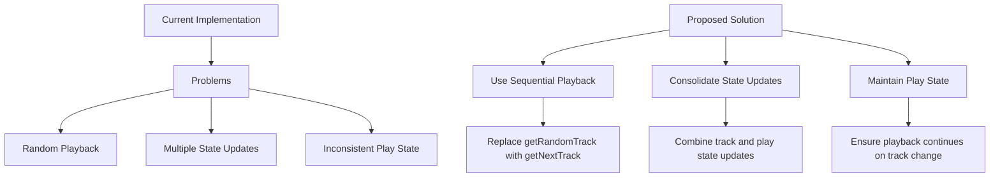

# Music Player Fixes

## Current Issues

1. **Random Track Selection**

   - `nextTrack` function uses `getRandomTrack` instead of sequential playback
   - Creates unpredictable playback experience

2. **Multiple State Updates**

   - `nextTrack` calls `playTrack`, causing multiple state updates
   - Can lead to visual glitches and track skipping

3. **Track Change Triggers**

   - Multiple sources trigger track changes:
     - Direct UI calls
     - YouTube player errors
     - Track completion
   - Lack of coordination between these sources

4. **Playback State**
   - `nextTrack` doesn't properly maintain playing state
   - Track changes can pause playback unexpectedly

## Implementation Plan

### 1. Update MusicPlayerProvider

- Replace `getRandomTrack` with `getNextTrack` for sequential playback
- Consolidate state updates in the `nextTrack` function
- Ensure play state is maintained during track changes

### 2. Update YouTubePlayer

- Improve error handling to prevent rapid track skipping
- Add debouncing for error-triggered track changes
- Ensure consistent state updates when track ends naturally

## Expected Outcomes

1. Sequential track playback instead of random
2. Smoother track transitions without visual glitches
3. Consistent playback state during track changes
4. More reliable error handling with fewer skips
