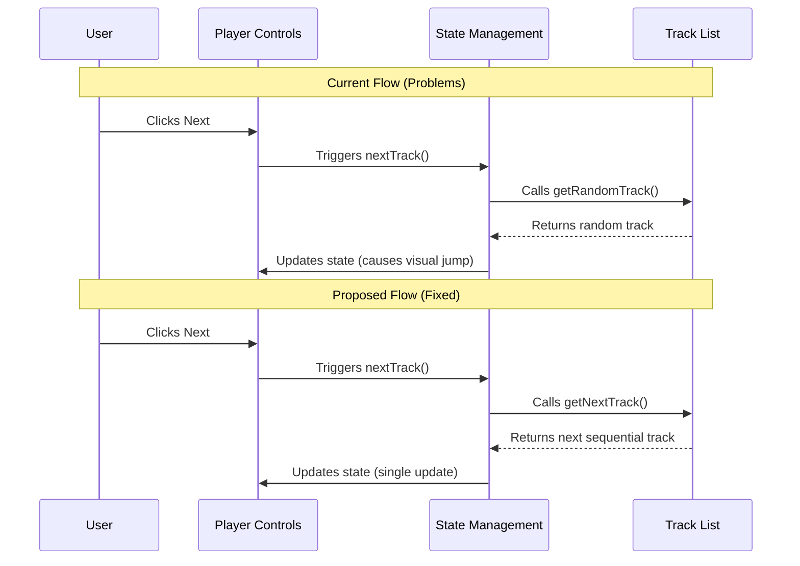

# Music Player Navigation Fixes

## Current Issues

1. **Random vs Sequential Playback**

   - Currently using `getRandomTrack` for next track selection
   - User wants sequential playback
   - `getNextTrack` function exists but isn't being used

2. **Track Skipping Visual Issue**
   - Track history management causing rapid visual updates
   - State updates not properly batched
   - Track changes appear jumpy

## Proposed Solution



## Implementation Plan

1. **Update MusicPlayerProvider.tsx**

   - Replace `getRandomTrack` with `getNextTrack` in the `nextTrack` function

   ```typescript
   const nextTrack = () => {
     if (state.currentTrack) {
       const nextTrack = getNextTrack(state.currentTrack);
       playTrack(nextTrack);
     }
   };
   ```

2. **Optimize Track Management**

   - Use existing `getNextTrack` function from trackList.ts
   - Refactor track history management to prevent unnecessary state updates
   - Consider removing track history for simpler state management

3. **Potential Future Improvements**
   - Add playback mode toggle (random/sequential)
   - Add transition animations for smoother track changes
   - Implement loading state during track transitions

## Benefits

- Predictable sequential playback
- Smoother visual transitions
- Better user experience with clear track progression
