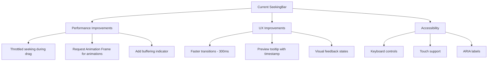
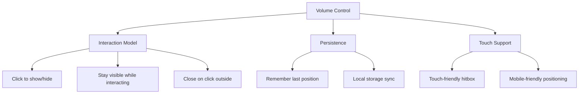

# Music Player Improvements Plan

## Current Issues

### SeekingBar Issues

1. Performance & Precision:

   - Continuous seeking during drag causing performance issues
   - Imprecise positioning using clientX
   - No touch device support
   - Missing buffering indicator

2. UX Issues:
   - 700ms transition for height is too slow
   - No keyboard accessibility
   - No preview of seek position
   - No visual feedback during loading/buffering

### Volume Control Issues

1. Popup Behavior:
   - Volume popup disappears too quickly
   - Complex transition logic with multiple delays
   - No persistent state option
   - Hover-only interaction problematic for touch devices

## Proposed Solutions

### 1. SeekingBar Improvements



### 2. Volume Control Improvements



## Technical Implementation Plan

### 1. SeekingBar Component

```typescript
// Performance Improvements
- Add throttling to seeking updates (every 16ms)
- Use RequestAnimationFrame for smooth animations
- Implement buffering indicator using loading state from player

// UX Improvements
- Reduce transition duration to 300ms
- Add preview tooltip showing timestamp on hover
- Add visual feedback for loading/buffering states
- Implement double-click to seek forward/backward

// Accessibility
- Add keyboard controls (arrow keys, home/end)
- Implement touch events (touchstart, touchmove, touchend)
- Add proper ARIA labels and roles
- Support screen readers with time announcements
```

### 2. Volume Control Component

```typescript
// Interaction Improvements
- Replace hover logic with click-to-show
- Add click-outside detection for closing
- Add toggle button for persistent visibility
- Implement touch-friendly controls

// State Management
- Store volume preferences in localStorage
- Add volume presets (25%, 50%, 75%, 100%)
- Remember mute state between sessions

// Mobile Optimization
- Position menu above on mobile devices
- Increase touch targets for better usability
- Add haptic feedback on volume changes
```

### 3. Additional Features

```typescript
// New Features
- Add keyboard shortcuts (m for mute, space for play/pause)
- Implement visual wave form display (optional)
- Add mini preview on hover for longer tracks
- Support for speed control

// Performance Optimizations
- Use CSS transforms for animations
- Implement virtual scrolling for playlists
- Lazy load audio resources
- Add preloading for next track
```

## Next Steps

1. Switch to code mode to implement high-priority improvements:

   - Fix SeekingBar performance issues
   - Improve volume control interaction
   - Add basic accessibility support

2. Test improvements across different devices and browsers

3. Gather user feedback and iterate on the implementation
