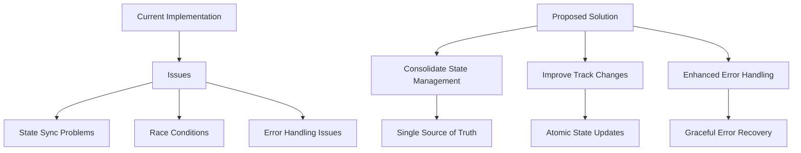

# Music Player Next Track Fix

## Current Issue

When clicking next track, the player pauses instead of continuing playback. This happens due to state management issues between the MusicPlayerProvider and YouTubePlayer components.

## Root Causes

1. **State Synchronization Issues**

   - Multiple effects handling player state independently
   - Potential race conditions during track transitions
   - Non-atomic state updates between components

2. **Track Change Complexity**
   - Track changes triggered from multiple sources
   - Inconsistent state management during transitions
   - Async nature of YouTube player operations

## Implementation Plan



### 1. State Management Consolidation

```typescript
// YouTubePlayer.tsx changes
useEffect(() => {
  if (!isAPIReady || !currentTrack) return;

  const initOrUpdatePlayer = async () => {
    try {
      if (playerRef.current) {
        await playerRef.current.loadVideoById({
          videoId: currentTrack.id,
          startSeconds: 0,
        });
        // Ensure play state is maintained
        if (isPlaying) {
          await playerRef.current.playVideo();
        }
      } else {
        // Initialize player with consistent state
        initializePlayer();
      }
    } catch (e) {
      console.error("Player update failed:", e);
      handleError();
    }
  };

  initOrUpdatePlayer();
}, [isAPIReady, currentTrack, isPlaying]);
```

### 2. Track Change Handling

- Ensure state updates are atomic
- Prevent race conditions during transitions
- Maintain play state consistently

### 3. Error Handling

- Add proper error recovery
- Prevent cascading state changes
- Maintain consistent player state

## Expected Results

1. Clicking next track will maintain playback state
2. Smoother transitions between tracks
3. More reliable error recovery
4. Consistent playback experience

## Testing Plan

1. Test basic next track functionality
2. Verify playback continues after track changes
3. Test error scenarios and recovery
4. Validate state consistency across components
