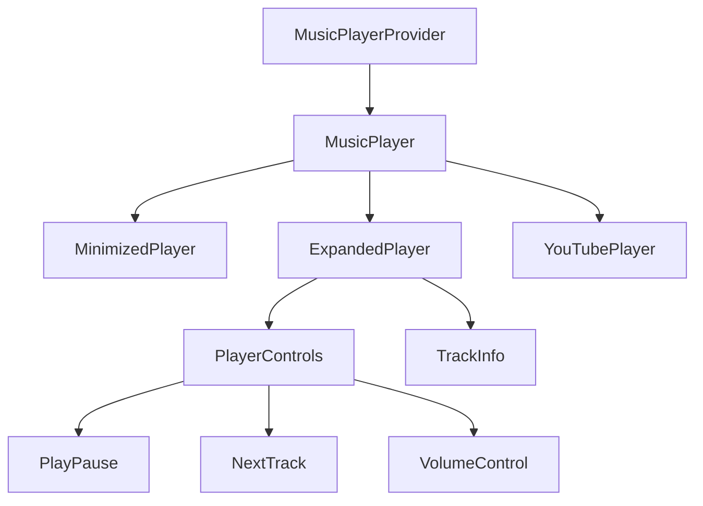

# Mini Music Player Implementation Plan

## Overview

Add a minimalistic YouTube-based music player that follows the project's existing design patterns and UI/UX standards. The player will be accessible through a circular button fixed in the bottom-right corner, expanding into a full player interface when clicked.

## Architecture



## Component Structure

```
src/
  components/
    music-player/
      MusicPlayer.tsx           # Main container component
      MinimizedPlayer.tsx       # Circular button view
      ExpandedPlayer.tsx        # Full player interface
      PlayerControls.tsx        # Control buttons
      YouTubePlayer.tsx         # YouTube iframe wrapper
      MusicPlayerProvider.tsx   # Context provider
      trackList.ts             # Hardcoded track list
      types.ts                 # TypeScript definitions
```

## Data Structures

```typescript
interface Track {
  id: string; // YouTube video ID
  title: string; // Song title
  artist: string; // Artist name
  duration: number; // Duration in seconds
}

interface PlayerState {
  currentTrack: Track | null;
  isPlaying: boolean;
  isMinimized: boolean;
  volume: number;
  isMuted: boolean;
}

interface PlayerContext extends PlayerState {
  playTrack: (track: Track) => void;
  pauseTrack: () => void;
  nextTrack: () => void;
  setVolume: (volume: number) => void;
  toggleMute: () => void;
  toggleMinimize: () => void;
}
```

## Design Details

### Minimized State (Circular Button)

- Fixed position: bottom-right corner
- Size: 48px x 48px
- Background: Surface color with border
- Hover effect: Scale transform + shadow
- Shows play/pause icon
- Active playback indicator: Subtle pulse animation

### Expanded State

- Width: 320px on desktop
- Height: 420px
- Position: Fixed bottom-right
- Border radius: Consistent with ThemePicker
- Backdrop filter: blur effect
- Animation: Similar to ThemePicker dropdown

## Technical Specifications

### YouTube Integration

- Use YouTube IFrame Player API
- Audio-only mode
- Hidden video element
- Preload next track
- Handle network issues gracefully

### State Management

- React Context for global player state
- localStorage for:
  - Volume preference
  - Last played track
  - Minimized state
- Custom hook: useMusicPlayer

### Mobile Handling

```typescript
const isMobileDevice = () => {
  return /Android|webOS|iPhone|iPad|iPod|BlackBerry|IEMobile|Opera Mini/i.test(
    navigator.userAgent
  );
};
```

### Track List Structure

```typescript
const tracks: Track[] = [
  {
    id: "dQw4w9WgXcQ", // Example YouTube ID
    title: "Never Gonna Give You Up",
    artist: "Rick Astley",
    duration: 213,
  },
  // More tracks...
];
```

## Implementation Phases

### Phase 1: Core Setup

1. Create component files
2. Set up YouTube player integration
3. Implement basic state management
4. Add track list

### Phase 2: UI Development

1. Build minimized player UI
2. Create expanded player layout
3. Add transition animations
4. Implement theme integration

### Phase 3: Features

1. Add play/pause functionality
2. Implement track switching
3. Add volume control
4. Implement random playback
5. Add desktop-only check

### Phase 4: Polish

1. Add loading states
2. Implement error handling
3. Add keyboard shortcuts
4. Optimize performance
5. Add persistence

## Accessibility Considerations

- Keyboard navigation
- ARIA labels
- Screen reader support
- Focus management

## CSS Integration

```css
.music-player-fade-in {
  animation: playerFadeIn 0.2s ease-out;
}

@keyframes playerFadeIn {
  from {
    opacity: 0;
    transform: scale(0.95);
  }
  to {
    opacity: 1;
    transform: scale(1);
  }
}
```

## Next Steps

1. Review and approve plan
2. Set up component structure
3. Begin implementation in phases
4. Test across browsers
5. Add documentation
