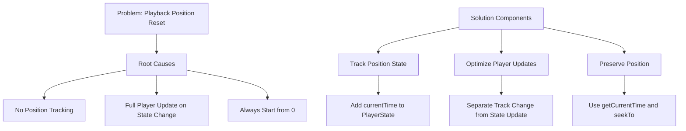

# Music Player Position Reset Fix

## Problem

Currently, the music player resets to the beginning of the song whenever:

- Volume is changed
- Play/pause state is toggled
- Song is resumed from pause

## Root Causes

1. No position tracking in player state
2. Full player update triggered on any state change
3. Always starting playback from position 0

## Solution Architecture



## Implementation Plan

### 1. Modify PlayerState Interface

```typescript
interface PlayerState {
  // ... existing fields ...
  currentTime: number; // Track current playback position
}

interface PlayerContext extends PlayerState {
  // ... existing methods ...
  updateCurrentTime: (time: number) => void;
  seekTo: (time: number) => void;
}
```

### 2. Update YouTubePlayer Component

- Store current position before state updates
- Only reload video when track ID changes
- Use seekTo() to restore position after updates
- Add periodic position saving
- Remove volume from player update dependencies

### 3. Implementation Steps

1. Update types.ts with new state fields
2. Modify MusicPlayerProvider to handle position tracking
3. Update YouTubePlayer state management
4. Add position persistence
5. Test various state change scenarios

### 4. Code Changes Required

1. types.ts: Add new state fields
2. MusicPlayerProvider.tsx:
   - Add currentTime state
   - Add position update methods
   - Handle position persistence
3. YouTubePlayer.tsx:
   - Store position before updates
   - Optimize state change handling
   - Add position restoration
   - Implement periodic position updates

### 5. Testing Plan

1. Verify position maintained when:
   - Changing volume
   - Toggling play/pause
   - Adjusting progress
   - Switching tracks
2. Check position persistence
3. Verify smooth playback resumption
4. Test edge cases (0, end of track)
