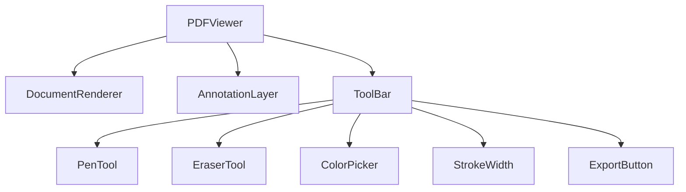
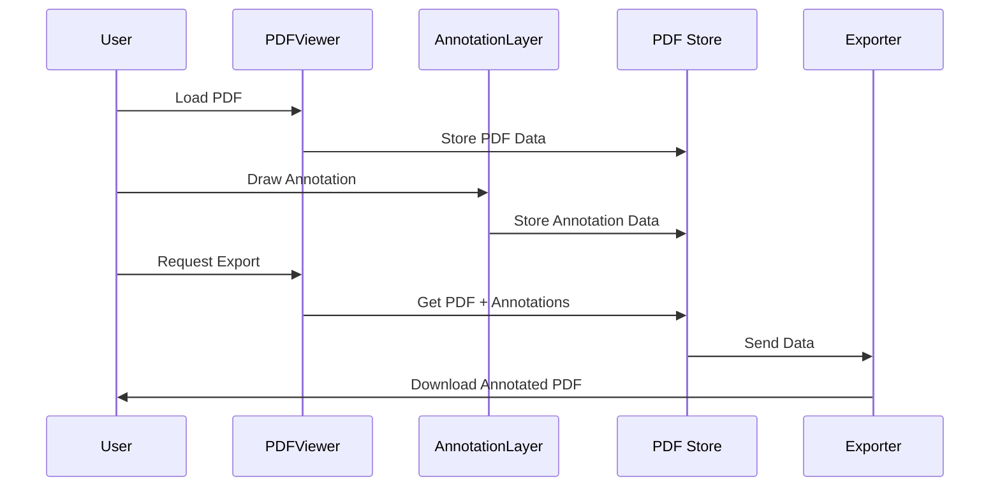

# PDF Annotator Implementation Plan

## 1. Component Structure



## 2. Core Implementation Strategy

### 2.1. PDF Rendering Layer

- Use `react-pdf` for rendering the PDF document
- Implement proper scaling and viewport management
- Handle page navigation and zoom controls
- Structure: Client-side rendered component using dynamic import

### 2.2. Annotation Layer

- Create a Canvas-based annotation layer that perfectly aligns with PDF pages
- Key features:
  ```typescript
  interface AnnotationLayer {
    canvasRef: React.RefObject<HTMLCanvasElement>;
    scale: number; // Matches PDF scale
    offset: { x: number; y: number }; // For alignment
    annotations: AnnotationData[];
  }
  ```
- Use separate canvas for each page to handle multi-page PDFs efficiently
- Implement coordinate mapping system to ensure annotations stay aligned

### 2.3. Drawing Tools Implementation

```typescript
interface DrawingTool {
  type: "pen" | "eraser";
  color?: string; // For pen only
  width: number;
  opacity?: number;
}

interface Path {
  tool: DrawingTool;
  points: Point[];
  timestamp: number;
}
```

## 3. Key Features

### 3.1. Toolbar UI

- Modern, floating toolbar design
- Tool selection with visual feedback
- Color picker for pen
- Stroke width adjustment
- Clear all/page options

### 3.2. Drawing Mechanics

- Smooth path interpolation for pen tool
- Pressure sensitivity support (if available)
- Efficient eraser tool with adjustable size
- Preview of tool size/color

### 3.3. PDF Export Process

1. Capture annotations per page
2. Convert canvas drawings to PDF graphics
3. Merge with original PDF maintaining perfect alignment
4. Use PDF-lib for final export

## 4. Technical Architecture



## 5. Implementation Phases

### Phase 1 (Initial Setup)

1. Create PDFViewer component structure
2. Implement basic PDF rendering
3. Add annotation canvas layer
4. Ensure perfect alignment between PDF and canvas

### Phase 2 (Core Tools)

1. Implement toolbar UI
2. Add pen tool with basic drawing
3. Add eraser tool
4. Implement color picker and stroke width

### Phase 3 (Export & Polish)

1. Implement PDF export functionality
2. Add smooth drawing interpolation
3. Optimize performance
4. Add error handling and loading states

## 6. Technical Considerations

1. Performance Optimization:

   - Use `requestAnimationFrame` for smooth drawing
   - Implement canvas clearing and redrawing strategies
   - Efficient memory management for large PDFs

2. Alignment Solution:

   ```typescript
   interface Coordinate {
     viewportX: number;
     viewportY: number;
     pdfX: number;
     pdfY: number;
     scale: number;
   }
   ```

3. State Management:
   - Use React context for tool states
   - Implement undo/redo functionality
   - Store annotations in IndexedDB for persistence
