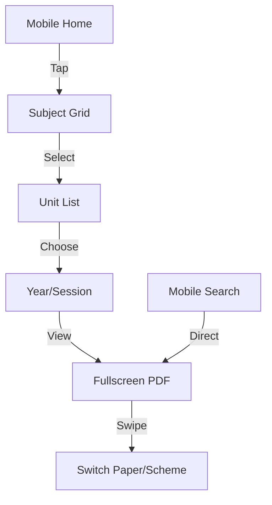
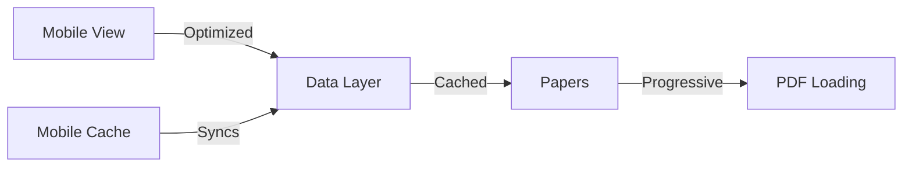

# Past Papers Website Project Plan

## Project Overview

A Next.js-based mobile-responsive website for organizing and accessing past papers across multiple subjects (10+), their units (approximately 6 per subject), spanning years 2001-2025 with 2-3 sessions per year, with PDF storage on Bunkr.

## Data Structure

```typescript
interface Unit {
  id: string;
  name: string;
  order: number;
  description?: string;
}

interface Paper {
  id: string;
  subject: string;
  unit: Unit;
  year: number;
  session: string;
  pdfUrl: string;
  markingSchemeUrl: string;
  title: string;
}

interface Subject {
  id: string;
  name: string;
  units: Unit[];
  papers: Paper[];
}
```

## Phase 1: Core Data and Mobile-First PDF Integration

**Timeline: Week 1**

- [x] Initialize Next.js project with TypeScript and Tailwind CSS
- [x] Implement enhanced data structure with units
- [ ] Set up Bunkr integration for PDF storage
- [x] Create comprehensive mock data structure:
  - 3 initial subjects
  - 6 units per subject
  - 5 sessions across different years
- [x] Implement responsive PDF viewer:
  - Desktop: Side-by-side papers and marking schemes
  - Mobile: Swipeable view between papers and schemes
- [x] Add mobile-optimized PDF download functionality
- [x] Implement touch-friendly controls

**Testing Checklist:**

- [x] Test PDF viewing on various mobile devices
- [x] Verify swipe gestures and touch controls
- [x] Validate data structure with units
- [x] Test responsive layouts
- [ ] Check download functionality on mobile networks

## Phase 2: Mobile-Optimized Search and Navigation

**Timeline: Week 1-2**

- [ ] Implement touch-friendly hierarchical navigation:
  - Mobile-first subject selection
  - Responsive unit filtering
  - Touch-optimized year/session selection
- [ ] Create mobile-friendly quick access filters
- [ ] Add URL-based deep linking
- [ ] Implement mobile-optimized search with unit awareness
- [ ] Create adaptive dual-panel results view
  - Desktop: Side-by-side display
  - Mobile: Full-screen with easy switching

**Testing Checklist:**

- [ ] Test navigation on multiple screen sizes
- [ ] Verify touch interactions
- [ ] Validate URL navigation
- [ ] Check mobile search experience
- [ ] Test panel switching on mobile

## Phase 3: Responsive UI Enhancement

**Timeline: Week 2**

- [ ] Design mobile-first unit selection interface
- [ ] Implement responsive paper-scheme viewing
- [ ] Add mobile-optimized search suggestions
- [ ] Create adaptive unit overview pages
- [ ] Implement collapsible navigation
- [ ] Add mobile-friendly recent papers section
- [ ] Optimize touch targets and spacing

**Testing Checklist:**

- [ ] Test on various mobile devices
- [ ] Verify touch-friendly UI elements
- [ ] Check responsive breakpoints
- [ ] Validate mobile navigation
- [ ] Test orientation changes

## Phase 4: Mobile Performance Optimization

**Timeline: Week 3**

- [ ] Implement mobile-aware caching strategy
- [ ] Add touch-friendly virtual scrolling
- [ ] Optimize PDF loading for mobile networks
- [ ] Add mobile gesture shortcuts
- [ ] Implement progressive loading for mobile
- [ ] Optimize images for different screen sizes

**Testing Checklist:**

- [ ] Test on various mobile networks (3G/4G)
- [ ] Measure mobile load times
- [ ] Verify offline functionality
- [ ] Test gesture controls
- [ ] Check progressive loading

## Phase 5: Mobile Polish and Advanced Features

**Timeline: Week 3-4**

- [ ] Add mobile-specific unit filtering
- [ ] Implement touch-friendly "related papers"
- [ ] Add mobile progress tracking
- [ ] Create responsive statistics display
- [ ] Implement mobile-first sorting options
- [ ] Add bottom navigation for mobile

**Testing Checklist:**

- [ ] Comprehensive mobile testing
- [ ] Verify touch interactions
- [ ] Check mobile-specific features
- [ ] Test offline capabilities
- [ ] Validate mobile navigation patterns

## Mobile-First User Interface Structure



## Critical Success Metrics

1. Maximum 2 taps to reach any paper on mobile
2. PDF load time < 3 seconds on 4G
3. Search response time < 500ms on mobile
4. 100% paper-scheme pairing accuracy
5. Zero missing unit assignments
6. Smooth performance on mid-range devices

## Mobile-Optimized Features

1. Bottom navigation bar
2. Swipeable interfaces
3. Touch-friendly filters
4. Mobile-optimized PDF viewing
5. Offline capability
6. Progressive loading
7. Adaptive layouts

## Data Organization Strategy



## Implementation Priorities

1. Mobile-first development approach
2. Touch-friendly navigation
3. Responsive PDF viewing
4. Fast mobile search
5. Offline capabilities
6. Performance optimization

## Important Notes

- Always test on real mobile devices
- Ensure touch targets are at least 44px
- Optimize for various network conditions
- Implement proper gesture handling
- Consider mobile-specific features
- Regular testing across devices
- Document mobile patterns

Remember: Success depends on providing an excellent mobile experience while maintaining all functionality across devices.
