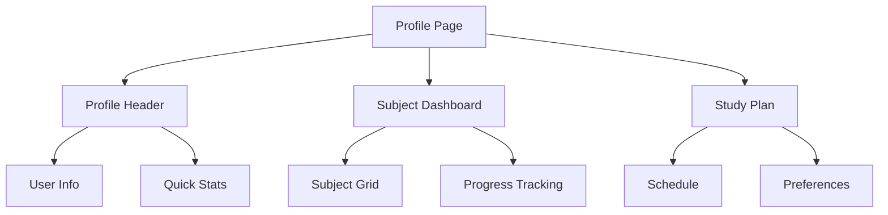
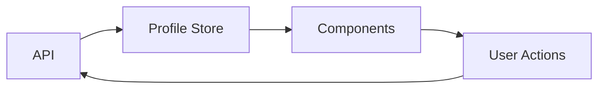

# Profile Page Implementation Sequence

## Phase 1: Core Layout & Data Structure

### 1. Base Layout Components (2 days)

- Create profile page container
- Implement responsive grid system
- Set up theme integration
- Add basic loading states

### 2. Data Management (2 days)

- Define all TypeScript interfaces
- Create API endpoints for profile data
- Implement data fetching hooks
- Set up error handling

### 3. Profile Header (2 days)

- User info display
- Stats overview
- Quick actions menu
- Empty state handling

## Phase 2: Subject Management (1 week)

### 1. Subject Grid

- Grid layout with responsive design
- Subject card component
- Filter and sort functionality
- Empty state with subject suggestions

### 2. Subject Details

- Progress tracking
- Unit completion status
- Target grades display
- Edit capabilities

### 3. Subject Actions

- Add/Remove subjects
- Update progress
- Set target grades
- Schedule management

## Phase 3: Study Plan Integration (1 week)

### 1. Study Schedule

- Weekly calendar view
- Time block management
- Study session tracking
- Schedule recommendations

### 2. Progress Tracking

- Overall progress dashboard
- Subject-wise progress
- Achievement system
- Goal setting interface

### 3. Preferences Management

- Study time preferences
- Notification settings
- Theme customization
- Language preferences

## Phase 4: Interactive Features (1 week)

### 1. Real-time Updates

- WebSocket integration
- Progress synchronization
- Activity feed
- Notifications

### 2. Social Features

- Study buddy system
- Progress sharing
- Achievement showcase
- Community integration

### 3. Data Visualization

- Progress charts
- Study time analytics
- Performance trends
- Subject comparison

## Phase 5: Polish & Optimization (3 days)

### 1. Performance

- Component lazy loading
- Image optimization
- Cache implementation
- Bundle size reduction

### 2. Animation & Transitions

- Page transitions
- Component animations
- Loading states
- Interaction feedback

### 3. Error Handling

- Error boundaries
- Fallback UI
- Recovery mechanisms
- Error logging

## Pre-requisite Tasks

1. Set up base components:

```bash
# Create directory structure
mkdir -p src/components/profile
mkdir -p src/hooks/profile
mkdir -p src/lib/profile
```

2. Initialize API routes:

```bash
# Create API endpoints
touch src/app/api/user/profile/route.ts
touch src/app/api/user/subjects/route.ts
touch src/app/api/user/preferences/route.ts
```

3. Create TypeScript types:

```typescript
// src/types/profile.d.ts
interface ProfileData {
  user: UserProfile;
  subjects: SubjectProgress[];
  preferences: StudyPreferences;
  progress: ProgressMetrics;
}
```

## Component Dependencies



## Data Flow



## Testing Strategy

1. Component Testing

```bash
# Create test files
touch src/components/profile/__tests__/ProfileHeader.test.tsx
touch src/components/profile/__tests__/SubjectDashboard.test.tsx
```

2. Integration Testing

```bash
# Create test files
touch src/tests/integration/profile.test.tsx
touch src/tests/integration/subjects.test.tsx
```

## Deployment Checklist

- [ ] Component library documentation
- [ ] API documentation
- [ ] Performance benchmarks
- [ ] Accessibility audit
- [ ] Browser testing
- [ ] Mobile responsiveness
- [ ] Error tracking setup
- [ ] Analytics integration

## Success Metrics

1. Performance

- First contentful paint < 1.5s
- Time to interactive < 3.5s
- Core Web Vitals passing

2. User Experience

- Profile completion rate > 80%
- Subject management usage > 60%
- Study plan adoption > 40%

3. Technical

- Test coverage > 85%
- Accessibility score > 95%
- Performance score > 90%

## Monitoring & Maintenance

1. Key Metrics

- Page load time
- User engagement
- Error rates
- API response times

2. Regular Tasks

- Weekly performance review
- Bug triage
- Feature request review
- Documentation updates

3. Long-term

- Monthly UX review
- Quarterly feature planning
- Performance optimization
- Technical debt management
