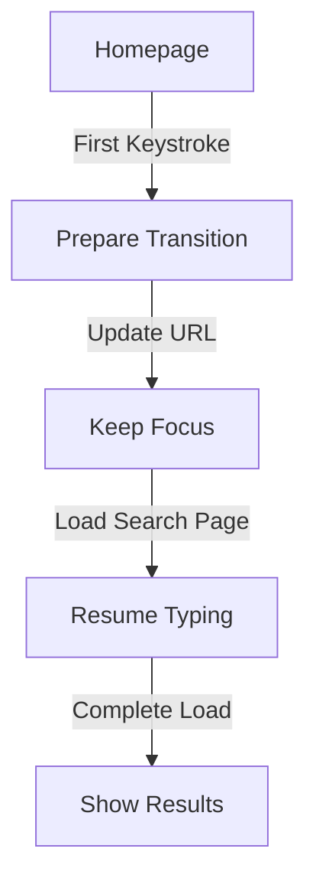

# Smooth Search Transition Implementation

## Overview

Create a seamless search experience where users can start typing on the homepage and transition to the search page without interruption.

## Key Requirements

1. Instant responsiveness to first keystroke
2. Maintain keyboard focus during navigation
3. Smooth visual transition
4. No perceived page reload
5. Mobile keyboard persistence

## Technical Architecture

### 1. State Management

```typescript
interface SearchState {
  query: string;
  isFocused: boolean;
  isTransitioning: boolean;
  inputRef: RefObject<HTMLInputElement>;
}
```

### 2. Navigation Flow



### 3. Key Components

#### SearchProvider

- Maintains global search state
- Handles URL synchronization
- Manages input focus

#### TransitionManager

- Coordinates smooth transitions
- Handles loading states
- Manages mobile keyboard

#### FocusController

- Preserves input focus
- Handles mobile keyboard events
- Manages scroll position

## Implementation Strategy

### 1. Initial Setup

```typescript
// Use shallow routing for smooth transitions
const handleFirstKeystroke = (char: string) => {
  router.push(`/search?q=${char}`, undefined, {
    shallow: true,
    scroll: false,
  });
};
```

### 2. Focus Management

```typescript
// Preserve focus across navigation
useEffect(() => {
  if (isTransitioning && inputRef.current) {
    inputRef.current.focus();
    // Prevent scroll jump on mobile
    window.scrollTo(0, 0);
  }
}, [isTransitioning]);
```

### 3. Mobile Optimizations

```typescript
// Prevent keyboard dismissal on iOS
const preventKeyboardDismiss = () => {
  if (isMobile) {
    document.body.style.position = "fixed";
    return () => {
      document.body.style.position = "";
    };
  }
};
```

## Mobile Considerations

### iOS Safari

1. Prevent viewport bounce
2. Handle keyboard events
3. Maintain scroll position

### Android Chrome

1. Handle back button
2. Manage keyboard visibility
3. Handle orientation changes

## Performance Optimizations

### 1. Preloading

- Preload search page components
- Cache recent search results
- Prefetch common completions

### 2. Input Debouncing

```typescript
const debouncedSearch = useDebounce(query, {
  wait: 150,
  leading: true, // Important for first character
});
```

### 3. Progressive Enhancement

1. Start with basic navigation
2. Enhance with smooth transitions
3. Add animations if supported

## Testing Strategy

### 1. Core Functionality

- Input handling
- Navigation flow
- Focus management

### 2. Mobile Testing

- Touch events
- Keyboard behavior
- Orientation changes

### 3. Performance Testing

- Time to first character
- Navigation latency
- Animation smoothness

## Edge Cases

### 1. Network Issues

- Handle slow connections
- Provide offline fallback
- Show loading states

### 2. User Interactions

- Handle rapid typing
- Manage multiple keystrokes
- Handle paste events

### 3. Browser Quirks

- Safari focus issues
- Chrome back button
- Firefox transitions

## Success Metrics

1. Time to First Character (TTFC)

   - Target: < 100ms
   - Must feel instant

2. Navigation Time

   - Target: < 300ms
   - Should feel seamless

3. Input Latency

   - Target: < 16ms
   - No perceived lag

4. Mobile Metrics
   - Keyboard show time
   - Focus retention rate
   - Transition smoothness
