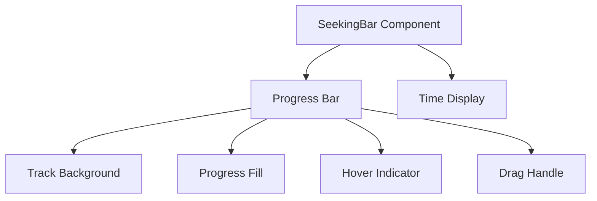

# Seeking Bar Implementation Plan

## Overview

Add an animated seeking bar to the music player that:

- Shows current playback position
- Allows seeking by clicking/dragging
- Has a smooth progress animation
- Shows hover preview of seek position
- Includes fancy micro-interactions

## Design



## Component Structure

1. `SeekingBar.tsx` - Main seeking bar component

   - Positioned between track info and controls
   - Full width with padding
   - Contains time display and progress bar

2. Progress Bar Features:
   - Animated progress fill
   - Hover effect with time preview
   - Interactive drag handle
   - Glowing active state
   - Smooth transitions

## Implementation Details

### 1. Visual Elements

```tsx
<div className="seeking-bar">
  <div className="time-display">
    <span>1:23</span>
    <span>3:45</span>
  </div>
  <div className="progress-container">
    <div className="track-bg" />
    <div className="progress-fill" />
    <div className="hover-indicator" />
    <div className="drag-handle" />
  </div>
</div>
```

### 2. Styling

```css
.seeking-bar {
  --progress: 45%;
  --bar-height: 4px;
  --handle-size: 12px;
}

.progress-fill {
  transform: scaleX(var(--progress));
  transform-origin: left;
  transition: transform 0.1s linear;
}

.drag-handle {
  transform: translateX(var(--progress));
  transition: transform 0.1s ease-out;
}
```

### 3. Animations

1. Progress Fill:

   - Smooth scale transform
   - Glowing active state
   - Color transitions

2. Hover Effects:

   - Scale up on hover
   - Ripple effect on click
   - Time preview tooltip

3. Drag Handle:
   - Pop out on hover
   - Scale on active
   - Smooth movement

## Integration Steps

1. Create SeekingBar component
2. Add seeking bar to ExpandedPlayer
3. Connect to player state:
   - Current time
   - Duration
   - Seeking callbacks
4. Add event handlers for:
   - Click to seek
   - Drag to seek
   - Hover preview
5. Implement animations
6. Add mobile support

## States to Track

```typescript
interface SeekingBarState {
  isHovering: boolean;
  isDragging: boolean;
  hoverPosition: number;
  dragPosition: number;
  progressPercent: number;
}
```

## Events to Handle

1. Mouse Events:

   - mouseDown (start drag)
   - mouseMove (update position)
   - mouseUp (end drag)
   - mouseEnter/Leave (hover effects)

2. Touch Events:
   - touchStart
   - touchMove
   - touchEnd

## Visual Polish

1. Colors:

   - Base: surface color
   - Fill: primary color
   - Glow: primary with opacity
   - Handle: white/primary

2. Transitions:

   - Progress: linear
   - Hover: ease-out
   - Drag: spring physics

3. Micro-interactions:
   - Ripple on click
   - Handle pop
   - Glow pulse
   - Smooth scrubbing
