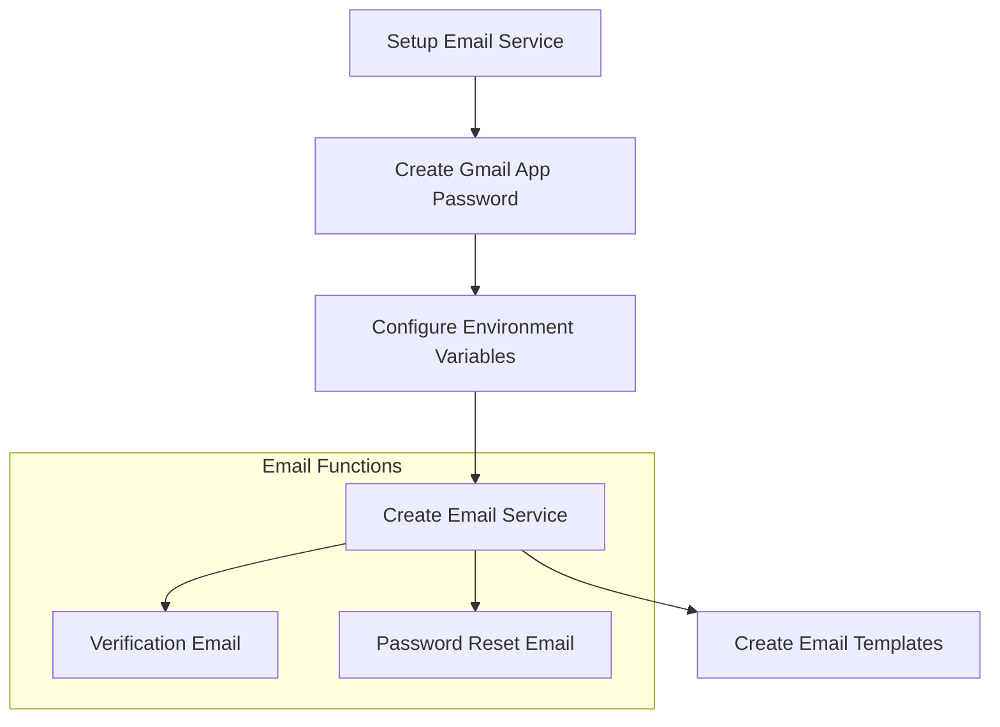
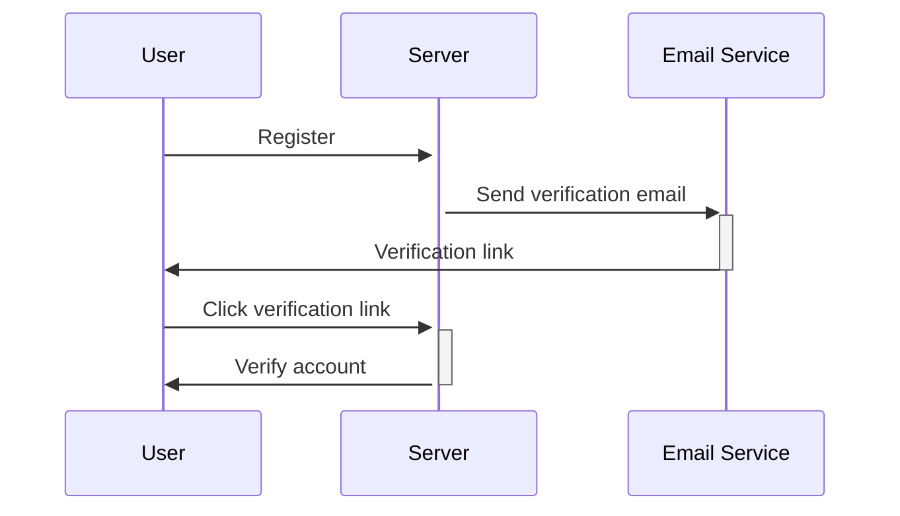
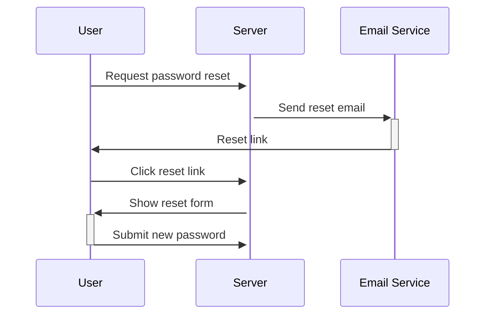

# Vercel Deployment Fixes & Email Service Implementation

## Overview

This document outlines improvements for Vercel deployment reliability and implementation of email services.

## 1. Vercel Deployment Fixes

### MongoDB Connection Improvements

```diff
// src/lib/mongodb.ts
- if (process.env.NODE_ENV === 'production' && !process.env.MONGODB_URI) {
+ if (!process.env.MONGODB_URI) {
-   console.log('Using mock MongoDB connection');
+   console.error('MONGODB_URI is not defined');
-   return mockMongoose;
+   throw new Error('MONGODB_URI is not defined');
}
```

### API Middleware Changes

```diff
// src/lib/api-middleware.ts
export function withDb(handler: ApiHandler, options: ApiMiddlewareOptions = {}) {
  return async function (req: NextRequest) {
    try {
-     // Skip DB connection during build
-     if (process.env.NODE_ENV === 'production' && !process.env.MONGODB_URI) {
-       if (options.requireConnection) {
-         return NextResponse.json(
-           { error: 'Service unavailable during build' },
-           { status: 503 }
-         );
-       }
-       return handler(req);
-     }

      // Connect to database
      await dbConnect();

      // Execute the handler
      const response = await handler(req);
      return response;
    } catch (error) {
      console.error('API Error:', error);

-     // If MongoDB connection error during build, return 503
-     if (process.env.NODE_ENV === 'production' && !process.env.MONGODB_URI) {
+     // If MongoDB connection error, return 503
+     if (error.name === 'MongoNetworkError' || error.name === 'MongoServerSelectionError') {
        return NextResponse.json(
          { error: 'Service temporarily unavailable' },
          { status: 503 }
        );
      }

      // Rest of error handling...
    }
  };
}
```

### Required Vercel Environment Variables

```
MONGODB_URI=mongodb+srv://...
NODE_ENV=production
```

### Vercel Configuration (vercel.json)

```json
{
  "builds": [
    {
      "src": "package.json",
      "use": "@vercel/next"
    }
  ],
  "env": {
    "MONGODB_URI": "@mongodb-uri"
  }
}
```

## 2. Email Service Implementation

### Gmail SMTP Setup

1. Create Gmail App Password:

   - Go to Google Account settings
   - Security > 2-Step Verification
   - App passwords > Create new app password
   - Select "Other (Custom name)"
   - Save the generated password

2. Environment Variables:

```
SMTP_HOST=smtp.gmail.com
SMTP_PORT=587
SMTP_USER=your-email@gmail.com
SMTP_PASS=your-app-password
```

### Email Service Flow



### Email Verification Flow



### Password Reset Flow



## 3. Implementation Checklist

### Vercel Deployment Fixes

- [ ] Remove mock MongoDB connection
- [ ] Update error handling in API middleware
- [ ] Add vercel.json configuration
- [ ] Set up environment variables in Vercel dashboard

### Email Service Setup

- [ ] Install nodemailer
- [ ] Create email service module
- [ ] Create email templates
- [ ] Add email verification endpoints
- [ ] Add password reset endpoints
- [ ] Update User model for email verification
- [ ] Add email verification UI
- [ ] Add password reset UI

### Monitoring Improvements

- [ ] Set up proper logging
- [ ] Add health check endpoint
- [ ] Add request logging middleware
- [ ] Configure MongoDB connection pooling

## Notes

- Keep email verification disabled until email service is fully tested
- Use test email accounts during development
- Monitor Vercel deployment logs for connection issues
- Consider rate limiting for email-related endpoints
